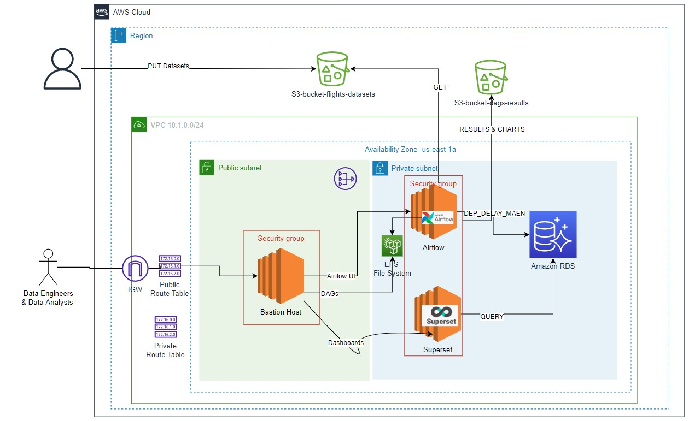
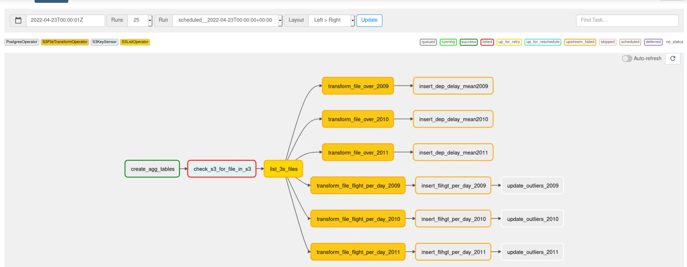
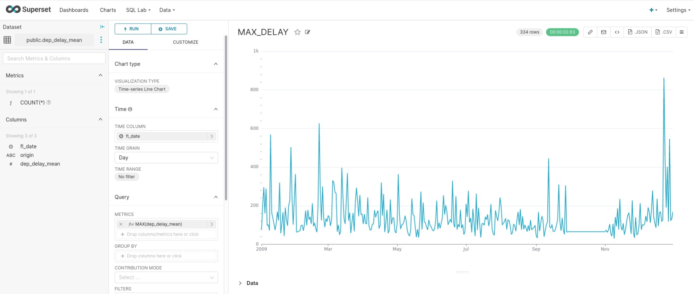
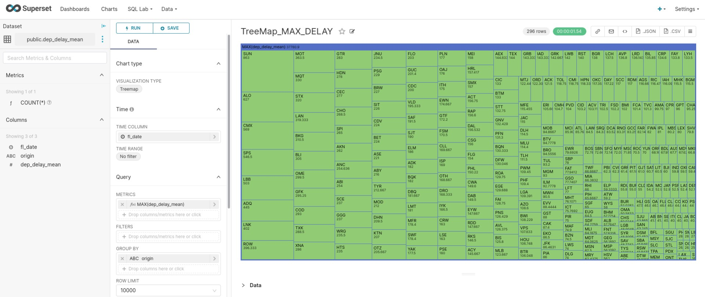

# Contexto

Acaba de ser contratado como el primer ingeniero de datos de una pequeña empresa de viajes. Su primera tarea para usted fue demostrar el valor y los conocimientos que se
pueden generar a partir de las canalizaciones de datos. Su plan es que una vez que demuestre lo valiosos que pueden ser los datos, comenzarán a invertir en el uso de un proveedor de instancias en la nube. Por ahora, su propia computadora tendrá que hacerlo.

# Objetivo
Crear un DAG de Airflow que actúe de ETL para extraer extraiga datos estáticos S3 y los cargue en una base de datos de Postgres.

# Datos a utilizar
Para llevar a cabo el desarrollo se utilizará el dataset de demoras y cancelaciones de viajes aéreos de Kaggle que será hosteado en un bucket creado por el alumno
en S3.

# Desarrollo

## Arquitectura 

## DAG 

## Visualizaciones
Linea de tiempo que muestra los promedios de retraso. Se puede observar a simple vista que los ultimos dias el año, en particular 23 de diceimbre, el promedio de retraso aumenta considerablemente.   

Tree Map que visualiza los aeropuertos segun el promedio de retraso.

